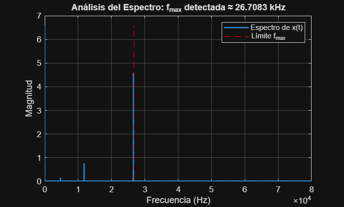
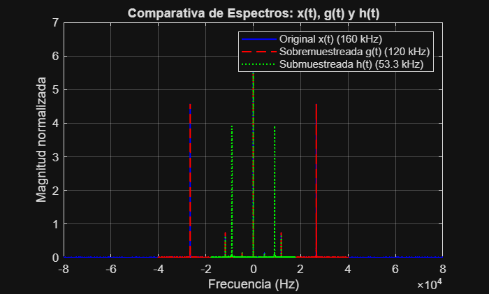
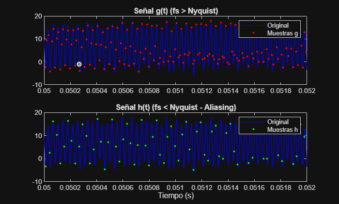
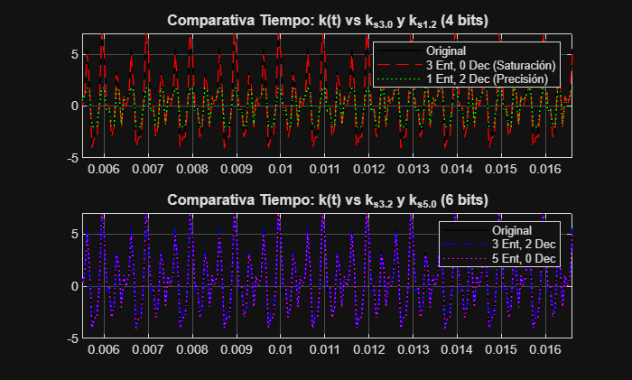
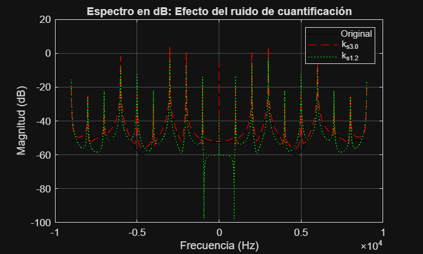
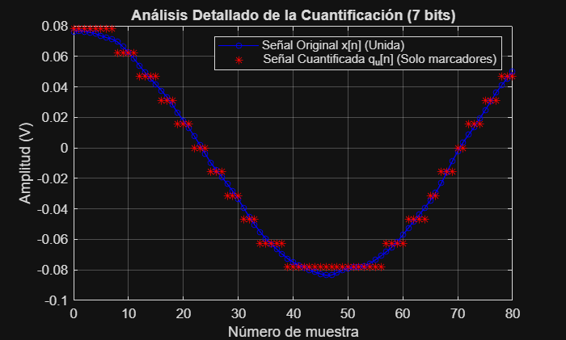

# PRÁCTICA 1: MUESTREO Y CUANTIFICACIÓN

En esta práctica trabajamos los dos procesos clave para convertir una señal analógica en digital: el muestreo (discretización en tiempo) y la cuantificación (discretización en amplitud). Analizaremos cómo la elección de estos parámetros afecta a la fidelidad de la señal reconstruida.

```matlab
% Carga de variables iniciales (señales x y k)
load('PDS_P1_3A_LE1_G4.mat') 
x = x(:); t = t(:); % Señal para el bloque de muestreo
k = k(:); t_k = t_k(:); % Señal para el bloque de cuantificación
```

## 1. MUESTREO

En este apartado analizamos cómo la frecuencia a la que tomamos muestras define si somos capaces de reconstruir la señal original o si perdemos información por el fenómeno del aliasing.

### **a) Frecuencia de muestreo de la señal original**

Para obtener la frecuencia de muestreo (**fs_x**), calculamos el inverso del tiempo entre dos muestras consecutivas.

```matlab
Ts = t(2) - t(1); 
fs_x = 1/Ts; 
disp(fs_x); % El resultado es 160.000 Hz
```

### **b) Frecuencia de Nyquist (fs_min)**

La frecuencia de Nyquist representa la tasa mínima de muestreo necesaria para evitar el solapamiento espectral (aliasing). Matemáticamente es el doble de la frecuencia máxima (**fmax**) contenida en la señal.

```matlab
% 1. Calculamos la frecuencia de muestreo original de x
Ts = t(2) - t(1);
fs_original = 1/Ts;

% 2. Calculamos la FFT de la señal x
N = length(x);
X_fft = fft(x);
X_mag = abs(X_fft) / N; % Magnitud normalizada

% 3. Creamos el vector de frecuencias (de 0 a fs)
f = (0:N-1) * (fs_original / N);

% 4. Buscamos la frecuencia máxima (fmax) 
% Definimos un umbral (ej. el 1% de la magnitud del pico más alto)
umbral = 0.01 * max(X_mag);
indices_con_energia = find(X_mag(1:floor(N/2)) > umbral); 
f_max_detectada = f(indices_con_energia(end));

% 5. Representación gráfica para la defensa
figure('Name', 'Comprobación de Frecuencia Máxima');
plot(f(1:floor(N/2)), X_mag(1:floor(N/2)), 'LineWidth', 1.5);
hold on;
line([f_max_detectada f_max_detectada], [0 max(X_mag)], 'Color', 'r', 'LineStyle', '--');
grid on;
title(['Análisis del Espectro: f_{max} detectada ≈ ', num2str(f_max_detectada/1000), ' kHz']);
xlabel('Frecuencia (Hz)');
ylabel('Magnitud');
legend('Espectro de x(t)', 'Límite f_{max}');
```



**Explicación para la defensa:** El Teorema de Nyquist-Shannon establece que para reconstruir una señal sin errores, la frecuencia de muestreo debe ser **mayor al doble de su componente de frecuencia más alta**. Si muestreamos por debajo, las réplicas del espectro se solapan y la señal se distorsiona.

### **c) Remuestreo de la señal (Señales g y h)**

Generamos dos nuevas señales cambiando su frecuencia de muestreo original mediante interpolación:

* **Señal g:** Muestreada a **fs_g = 1,5 * fs_min** (Cumple Nyquist, mucha resolución).
* **Señal h:** Muestreada a **fs_h = 2/3 * fs_min** (No cumple Nyquist, habrá aliasing).

```matlab
fs_g = (3/2) * fs_min;
fs_h = (2/3) * fs_min;

% Generamos los nuevos vectores de tiempo
t_g = (t(1) : 1/fs_g : t(end)).';
t_h = (t(1) : 1/fs_h : t(end)).';

% Interpolación spline para obtener los nuevos valores
g = interp1(t, x, t_g, 'spline');
h = interp1(t, x, t_h, 'spline');
```

### **d) Representación del espectro en frecuencia**

Para analizar el contenido frecuencial, utilizamos la Transformada Rápida de Fourier (**FFT**). Es vital usar **fftshift** para mover la frecuencia 0 al centro de la gráfica y poder ver las frecuencias negativas y positivas.

```matlab
% Calculamos la FFT de cada señal y normalizamos por su longitud
X_f = fftshift(abs(fft(x)/length(x)));
G_f = fftshift(abs(fft(g)/length(g)));
H_f = fftshift(abs(fft(h)/length(h)));

% Generamos los ejes de frecuencia (cada uno depende de su propia fs)
f_x = linspace(-fs_x/2, fs_x/2, length(x));
f_g = linspace(-fs_g/2, fs_g/2, length(g));
f_h = linspace(-fs_h/2, fs_h/2, length(h));

% Representación comparativa
figure;
plot(f_x, X_f, 'b', 'LineWidth', 1.2); hold on;
plot(f_g, G_f, 'r--', 'LineWidth', 1.2);
plot(f_h, H_f, 'g:', 'LineWidth', 1.2);

grid on;
xlabel('Frecuencia (Hz)');
ylabel('Magnitud normalizada');
title('Comparativa de Espectros: x(t), g(t) y h(t)');
legend('Original x(t) (160 kHz)', 'Sobremuestreada g(t) (120 kHz)', 'Submuestreada h(t) (53.3 kHz)');
```



**Conclusiones para la defensa:**

* **Aliasing en h(t):** Al observar el espectro de la señal verde (**h**), verás que aparecen componentes que no estaban en la señal original o que el espectro está "deformado". Esto ocurre porque la frecuencia de muestreo **fs_h** es menor que la frecuencia de Nyquist (**fs_min**), provocando que las réplicas del espectro se solapen.
* **Energía de poca potencia:** Verás una pequeña cantidad de energía repartida por todo el eje de frecuencias. Esto no es ruido real de la señal, sino un efecto matemático llamado **fugas espectrales** (por recortar la señal en el tiempo) y al error de la interpolación **spline** al intentar inventar muestras.

### **e) Representación en el dominio del tiempo**

En el tiempo, el aliasing se traduce en una pérdida de la forma original de la onda.

```matlab
% Comparación temporal con zoom para apreciar las muestras
figure;
subplot(2,1,1);
plot(t, x, 'b'); hold on;
plot(t_g, g, 'r.'); 
title('Señal g(t) (fs > Nyquist)');
legend('Original', 'Muestras g');
xlim([0.05, 0.052]); % Zoom para ver los puntos

subplot(2,1,2);
plot(t, x, 'b'); hold on;
plot(t_h, h, 'g.');
title('Señal h(t) (fs < Nyquist - Aliasing)');
legend('Original', 'Muestras h');
xlim([0.05, 0.052]);
xlabel('Tiempo (s)');
```



**Explicación para la defensa:**

* En la señal **g(t)**, los puntos rojos siguen perfectamente la línea azul original. Tenemos suficientes muestras para reconstruir la señal.
* En la señal **h(t)**, los puntos verdes están tan separados que, al unirlos (interpolarlos), la forma resultante es distinta a la original (más lenta o deformada). Esto es la prueba visual de que hemos perdido información por no respetar el **Teorema de Nyquist**.

---

## 2. CUANTIFICACIÓN UNIFORME

En este bloque estudiamos cómo transformar los valores de amplitud continuos de la señal **k(t)** en valores discretos definidos por un número limitado de bits.

### **a) ¿Cuántos niveles de cuantificación se tendrán?**

Si utilizamos **B** bits totales para codificar cada nivel:

* El número de niveles totales es **2 elevado a B**.
* **Explicación para la defensa:** Independientemente de cuántos sean enteros o decimales, el número total de "escalones" posibles en la rejilla de cuantificación viene determinado únicamente por el número total de bits disponibles.

### **b) ¿De qué magnitud es el salto entre niveles (Delta V)?**

El salto o resolución del cuantificador depende del número de bits dedicados a la parte decimal (**D**).

* La magnitud del salto es **Delta V = 2 elevado a -D**.
* **Explicación para la defensa:** Cuantos más bits decimales tengamos, más pequeño será el escalón (mayor resolución) y, por tanto, el error de redondeo será menor.

### **c) ¿Cuál es el rango (niveles máximo y mínimo)?**

En un sistema de coma fija con **B** bits totales (1 de signo) y **D** decimales, el número de bits enteros es **I = B - 1 - D**.

* **Nivel Mínimo:** -(2 elevado a I).
* **Nivel Máximo:** (2 elevado a I) - (2 elevado a -D).

### **d) ¿Cuál es el rango de error de cuantificación para una muestra?**

Suponiendo un redondeo al nivel más cercano:

* El error máximo es la mitad del salto: **Epsilon = +/- (Delta V / 2)**.
* **Explicación para la defensa:** El error de cuantificación se comporta como un ruido aleatorio que añadimos a la señal original. Su valor máximo siempre está acotado por la mitad de la resolución del cuantificador.

### **e) Caso práctico: B = 5, D = 3**

Para estos valores, realizamos los cálculos numéricos:

* **Niveles:** 2 elevado a 5 = **32 niveles**.
* **Salto (Delta V):** 2 elevado a -3 = **0,125 V**.
* **Rango:** El bit de signo es 1, los decimales son 3, por tanto queda 1 bit entero (I = 5-1-3 = 1).

  * Mínimo: -(2 elevado a 1) = **-2 V**.
  * Máximo: 2 - 0,125 = **1,875 V**.
* **Error máximo:** 0,125 / 2 = **+/- 0,0625 V**.

### **f) Cuantificación de k(t) con diferentes configuraciones**

Aquí configuramos los 4 cuantificadores solicitados. Recuerda que el primer parámetro de `[B, D]` es el número de bits totales (Signo + Entera + Decimal).

```matlab
% Nota: B = 1 (signo) + bits_enteros + bits_decimales

% 1. 3 bits entera, 0 bits decimal: B = 1+3+0 = 4; D = 0
q30 = quantizer('fixed', 'round', 'saturate', [4, 0]);
k_s30 = bin2num(q30, num2bin(q30, k));

% 2. 1 bit entera, 2 bits decimal: B = 1+1+2 = 4; D = 2
q12 = quantizer('fixed', 'round', 'saturate', [4, 2]);
k_s12 = bin2num(q12, num2bin(q12, k));

% 3. 3 bits entera, 2 bits decimal: B = 1+3+2 = 6; D = 2
q32 = quantizer('fixed', 'round', 'saturate', [6, 2]);
k_s32 = bin2num(q32, num2bin(q32, k));

% 4. 5 bits entera, 0 bits decimal: B = 1+5+0 = 6; D = 0
q50 = quantizer('fixed', 'round', 'saturate', [6, 0]);
k_s50 = bin2num(q50, num2bin(q50, k));
```

### **g) Análisis en el dominio del tiempo y la frecuencia**

Este código genera las comparativas visuales para que puedas comentar las diferencias.

```matlab
% --- ANÁLISIS TEMPORAL ---
figure('Name', 'Análisis Temporal Cuantificación');
subplot(2,1,1);
plot(t_k, k, 'k', 'LineWidth', 1); hold on;
plot(t_k, k_s30, 'r--'); 
plot(t_k, k_s12, 'g:');
title('Comparativa Tiempo: k(t) vs k_{s3.0} y k_{s1.2} (4 bits)');
legend('Original', '3 Ent, 0 Dec (Saturación)', '1 Ent, 2 Dec (Precisión)');
xlim([t_k(100) t_k(300)]); % Zoom para ver los escalones
grid on;

subplot(2,1,2);
plot(t_k, k, 'k', 'LineWidth', 1); hold on;
plot(t_k, k_s32, 'b--');
plot(t_k, k_s50, 'm:');
title('Comparativa Tiempo: k(t) vs k_{s3.2} y k_{s5.0} (6 bits)');
legend('Original', '3 Ent, 2 Dec', '5 Ent, 0 Dec');
xlim([t_k(100) t_k(300)]);
grid on;

% --- ANÁLISIS FRECUENCIAL ---
fs_k = 1/(t_k(2)-t_k(1));
f_k = linspace(-fs_k/2, fs_k/2, length(k));

K_f = fftshift(abs(fft(k)/length(k)));
K30_f = fftshift(abs(fft(k_s30)/length(k_s30)));
K12_f = fftshift(abs(fft(k_s12)/length(k_s12)));

figure('Name', 'Análisis Frecuencial Cuantificación');
plot(f_k, 20*log10(K_f), 'k'); hold on;
plot(f_k, 20*log10(K30_f), 'r--');
plot(f_k, 20*log10(K12_f), 'g:');
title('Espectro en dB: Efecto del ruido de cuantificación');
legend('Original', 'k_{s3.0}', 'k_{s1.2}');
ylabel('Magnitud (dB)'); xlabel('Frecuencia (Hz)');
grid on;
```





**Conclusiones para la defensa:**

* **En el tiempo:** Observarás que `k_s12` se "corta" (saturación/clipping) si la señal original sube de 2V, pero es más suave. `k_s30` no se corta, pero tiene escalones gigantes de 1V.
* **En la frecuencia:** Verás que las señales cuantificadas tienen un "suelo de ruido" más alto. Cuantos menos bits decimales, más alto es ese ruido base.

### **h) Error Cuadrático Medio (ECM)**

```matlab
% Cálculo del ECM siguiendo la fórmula del PDF
ecm_s30 = mean((k - k_s30).^2);
ecm_s12 = mean((k - k_s12).^2);
ecm_s32 = mean((k - k_s32).^2);
ecm_s50 = mean((k - k_s50).^2);

fprintf('ECM para k_s3.0: %e\n', ecm_s30);
fprintf('ECM para k_s1.2: %e\n', ecm_s12);
fprintf('ECM para k_s3.2: %e\n', ecm_s32);
fprintf('ECM para k_s5.0: %e\n', ecm_s50);
```

* ECM para k_s3.0: 1.153129e-01
* ECM para k_s1.2: 2.966719e+00
* ECM para k_s3.2: 9.039844e-03
* ECM para k_s5.0: 1.153129e-01

**Conclusión:** El mejor es `k_s32` porque tiene suficiente rango (3 bits enteros) para no saturar y precisión (2 bits decimales) para reducir el error.

---

## 3. AUDIO: CUANTIFICACIÓN Y ANÁLISIS

### **a) Preparación de la señal de audio (Eliminación de silencios)**

El enunciado pide ignorar los silencios iniciales y finales. Esto no es solo quitar los valores bajos, sino recortar la señal desde que empieza la voz hasta que termina.

```matlab
% 1. Leer el archivo
% SUSTITUYE 'audio_P1.wav' por el nombre exacto de tu archivo
nombre_archivo = 'audio_P1.wav'; 

if exist(nombre_archivo, 'file')
    [x_audio, fs_audio] = audioread(nombre_archivo);
else
    error('ERROR: No se encuentra el archivo %s. Verifica la carpeta.', nombre_archivo);
end

% 2. Eliminar silencios anteriores y posteriores (|x| < 0.01 V)
umbral = 0.01;
indices = find(abs(x_audio) >= umbral); % Busca dónde hay sonido
y_audio = x_audio(indices(1):indices(end)); % Recorta desde el primer sonido al último

% 3. Cuantificador de 7 bits (B=7)
% RAZONAMIENTO: 
% Las señales de audio suelen estar normalizadas entre -1 y 1. 
% Un cuantificador 'fixed' con B=7 usa 1 bit para el signo.
% Si asignamos D=6 bits decimales, el rango es [-1, 0.984]. Es la máxima resolución posible.
% Si asignamos D=5 bits decimales, el rango es [-2, 1.968]. Menos resolución pero evitamos saturar si hay picos en 1.
% ELEGIMOS: B=7, D=6 para priorizar la resolución en una señal normalizada.

B_audio = 7;
D_audio = 6;
q_audio = quantizer('fixed', 'round', 'saturate', [B_audio, D_audio]);
y_cuant = bin2num(q_audio, num2bin(q_audio, y_audio));

% 4. Reproducción (Descomenta para escuchar)
% disp('Escuchando original...'); sound(y_audio, fs_audio);
% pause(length(y_audio)/fs_audio + 1);
% disp('Escuchando cuantificada...'); sound(y_cuant, fs_audio);
```

---

## 4. ANÁLISIS DE RESULTADOS

### **a) Comparativa cualitativa**

```matlab
 1. Definir la frecuencia de muestreo (asegúrate de haberla obtenido con audioread)
% fs_audio es la que devuelve [x, fs_audio] = audioread(...)

fprintf('Reproduciendo señal ORIGINAL (sin silencios)...\n');
sound(y_audio, fs_audio); 

% Es necesario pausar el código mientras suena el audio 
% para que no empiece el siguiente inmediatamente.
pause(length(y_audio)/fs_audio + 1); 

fprintf('Reproduciendo señal CUANTIFICADA (7 bits)...\n');
sound(y_cuant, fs_audio);
```

1. **Ruido de cuantificación:** En la versión de 7 bits (`y_cuant`), notarás un siseo constante de fondo, similar al ruido de una cinta vieja o estática suave. Esto es porque el error entre la señal real y el "escalón" del cuantificador es aleatorio y suena como ruido blanco.
2. **Claridad:** A pesar del ruido, la voz debería seguir entendiéndose perfectamente. Esto indica que 7 bits (128 niveles) son suficientes para la inteligibilidad, aunque no para una calidad de "Alta Fidelidad" (que suele usar 16 o 24 bits).
3. **Partes suaves:** El ruido es mucho más evidente en las partes donde la voz habla más bajo, ya que la relación señal-ruido empeora.

### **b) Representación temporal con marcadores**

El PDF pide específicamente usar marcadores y unir **solo** los de la señal original para ver la diferencia.

```matlab
% Seleccionamos un segmento corto para que se vean bien los puntos (ej. 100 muestras)
segmento = 1000:1080; 
t_segmento = (0:length(segmento)-1); % Eje de muestras

figure('Name', 'Análisis de Resultados: Marcadores');
% Señal original: Unida con línea y con marcador de círculo
plot(t_segmento, y_audio(segmento), 'b-o', 'MarkerSize', 4); hold on;

% Señal cuantificada: SOLO el marcador (asterisco rojo), sin línea
plot(t_segmento, y_cuant(segmento), 'r*', 'MarkerSize', 6);

title('Análisis Detallado de la Cuantificación (7 bits)');
xlabel('Número de muestra');
ylabel('Amplitud (V)');
legend('Señal Original x[n] (Unida)', 'Señal Cuantificada q_u[n] (Solo marcadores)');
grid on;
```



Los asteriscos rojos están "forzados" a niveles fijos (horizontales), mientras que los círculos azules siguen la curva original. La distancia vertical entre un círculo y su asterisco es el **error de cuantificación**.

### **c) Comparativa cuantitativa (ECM)**

```matlab
% Cálculo del Error Cuadrático Medio
N_audio = length(y_audio);
ecm_audio = (1/N_audio) * sum((y_audio - y_cuant).^2);

fprintf('El Error Cuadrático Medio (ECM) del audio es: %e\n', ecm_audio);
```

* El Error Cuadrático Medio (ECM) del audio es: 2.031533e-05

1. **Error cualitativo:** La pérdida de bits se traduce en un ruido granular audible.
2. **Error visual:** Los marcadores muestran cómo la señal se discretiza en amplitud, perdiendo la suavidad de la onda original.
3. **Error cuantitativo:** El ECM nos da la potencia de ese ruido. A mayor número de bits decimales (D), menor será este valor de ECM.
