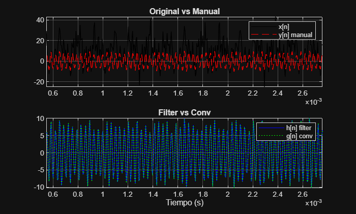
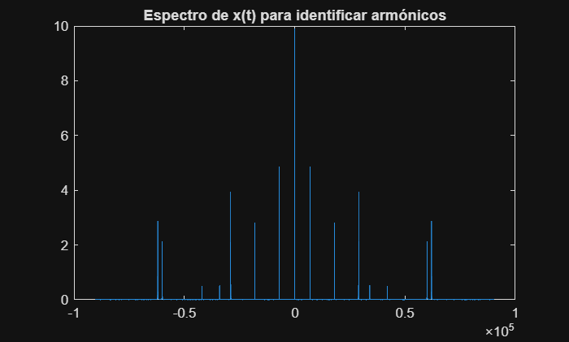
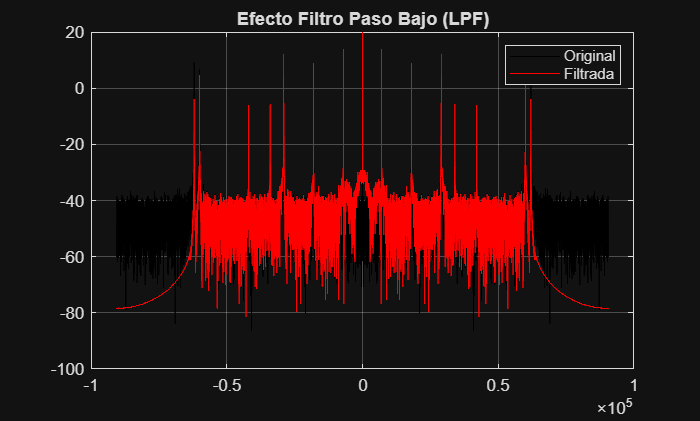
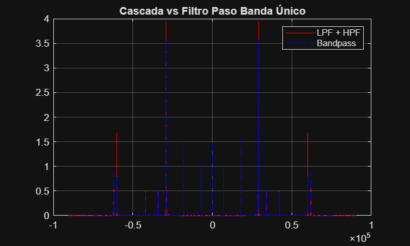
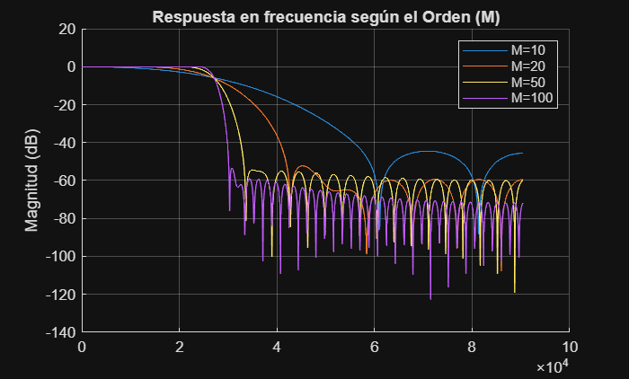

# PRÁCTICA 3: FILTROS DIGITALES FIR

El objetivo de esta práctica es dominar la implementación de filtros de respuesta impulsional finita (FIR) y entender cómo el diseño (frecuencias de corte) y el orden del filtro afectan a la señal.

```matlab
%% 0. CARGA DE DATOS E INICIALIZACIÓN
clear; close all; clc;
% Sustituye por el nombre exacto de tu archivo facilitado
load('PDS_P3_3A_LE2_G4.mat') 
x = x(:); t = t(:); b = b(:); % Aseguramos vectores columna
```

---

## 1. FILTRADO DE SEÑALES

### **a) Frecuencia de muestreo (fs)**

```matlab
fs = 1 / (t(2) - t(1));
fprintf('La frecuencia de muestreo es: %.0f Hz\n', fs);
```

### **b) Filtrado Manual (Sumatorio)**

**Lógica:** Implementamos la ecuación de diferencia $y[n] = \sum_{k=1}^{M+1} b_k \cdot x[n-k+1]$.

```matlab
M = length(b) - 1; % Orden del filtro
L = length(x);
y_manual = zeros(L, 1);

for n = 1:L
    for k = 1:M+1
        if (n - k + 1) > 0
            y_manual(n) = y_manual(n) + b(k) * x(n - k + 1);
        end
    end
end
```

### **c) Filtrado con función `conv`**

```matlab
% La convolución devuelve un vector de longitud L + M
g_conv = conv(b, x); 
% Para comparar con x[n], truncamos o tomamos la parte inicial
g_conv_adj = g_conv(1:L); 
```

### **d) Filtrado con función `filter`**

```matlab
% Es el método más eficiente. Devuelve la misma longitud que x.
h_filter = filter(b, 1, x);
```

### **e) Comparativa en el Dominio del Tiempo**

```matlab
figure('Name', 'Comparativa Métodos de Filtrado');
subplot(2,1,1)
plot(t, x, 'k'); hold on;
plot(t, y_manual, 'r--');
title('Original vs Manual'); legend('x[n]', 'y[n] manual');
xlim([t(100) t(500)]); grid on;

subplot(2,1,2)
plot(t, h_filter, 'b'); hold on;
plot(t, g_conv_adj, 'g:');
title('Filter vs Conv'); legend('h[n] filter', 'g[n] conv');
xlim([t(100) t(500)]); grid on; xlabel('Tiempo (s)');
```



> **Defensa:** "Los tres métodos son matemáticamente equivalentes. `filter` es preferible en tiempo real porque no genera la 'cola' de la convolución que sí genera `conv`, manteniendo la causalidad y el tamaño de la señal original."

### **f) Retardo Transitorio**

```matlab
retardo_muestras = k-1; % Para filtros FIR de fase lineal
retardo_ms = (retardo_muestras / fs) * 1000;
fprintf('El retardo introducido es de %.3f ms (%d muestras)\n', retardo_ms, retardo_muestras);
```

> **Defensa:** "El retardo transitorio se debe a que el filtro necesita que entren las primeras $M$ muestras para que el sumatorio esté 'lleno'. En un filtro FIR de fase lineal, el retardo de grupo es constante e igual a $M/2$."

---

## 2. DISEÑO DE FILTROS FIR

### **Análisis previo para elegir Fc**

Para diseñar, primero debemos saber qué queremos quitar.

```matlab
X_f = fftshift(abs(fft(x)/L));
f_axis = linspace(-fs/2, fs/2, L);
figure; plot(f_axis, X_f); title('Espectro de x(t) para identificar armónicos');
```



### **a, b) Diseño Paso Bajo (LPF)**

Para el diseño, abre `fdatool` en la consola. Configura:

1. **Response Type:** Lowpass
2. **Method:** Constrained Equiripple
3. **Order:** 100
4. **Frequencies:** Fs = (tu fs), Fpass = (antes del armónico alto), Fstop = (justo en el armónico alto).
5. **Magnitudes:** Apass = 0.1, Astop = 80.

**Código para verificar el efecto:**

```matlab
% Supongamos que exportaste los coeficientes como 'LPF_b'
y_lpf = filter(LPF_b, 1, x);
Y_LPF_f = fftshift(abs(fft(y_lpf)/L));

figure;
plot(f_axis, 20*log10(X_f), 'k'); hold on;
plot(f_axis, 20*log10(Y_LPF_f), 'r');
title('Efecto Filtro Paso Bajo (LPF)');
legend('Original', 'Filtrada'); grid on;
```



---

## 3. ANÁLISIS DE FILTROS: SUPERPOSICIÓN

### **a, b, c, d) Cascada vs Filtro Único**

```matlab
% 1. Cascada (LPF -> HPF)
y_temp = filter(LPF_b, 1, x);
y_cascada = filter(HPF_b, 1, y_temp);

% 2. Filtro Único (Diseñado en fdatool como Bandpass)
y_bandpass = filter(BP_b, 1, x);

% Espectros
Y_CASC_f = fftshift(abs(fft(y_cascada)/L));
Y_BP_f = fftshift(abs(fft(y_bandpass)/L));
```

### **e, f) Comparativa Frecuencial**

```matlab
figure;
plot(f_axis, Y_CASC_f, 'r'); hold on;
plot(f_axis, Y_BP_f, 'b--');
title('Cascada vs Filtro Paso Banda Único');
legend('LPF + HPF', 'Bandpass'); grid on;
```



> **Defensa:** "El filtrado en cascada suma los retardos de ambos filtros ($$
>
> $$
> ). Es más eficiente diseñar un único filtro Paso Banda de orden 100, ya que obtenemos la misma selectividad con la mitad de retardo y menos coste computacional."
> $$

---

## 4. ORDEN DEL FILTRO

Aquí analizamos cómo afecta el número de coeficientes a la "limpieza" del filtrado.

### **a, b) Comparación de órdenes con `freqz`**

```matlab
ordenes = [10, 20, 50, 100];
figure; hold on;

for M_val = ordenes
    % Diseñamos un LPF básico para cada orden
    % Usamos fir1 como alternativa rápida para la comparativa
    b_temp = fir1(M_val, 0.3); % Frecuencia normalizada 0.3
    [H, f_freqz] = freqz(b_temp, 1, 1024, fs);
    plot(f_freqz, 20*log10(abs(H)));
end

title('Respuesta en frecuencia según el Orden (M)');
legend('M=10', 'M=20', 'M=50', 'M=100');
ylabel('Magnitud (dB)'); grid on;
```



> **Defensa:** "A mayor orden $$, la pendiente de caída en la banda de transición es más vertical (el filtro es más selectivo). Sin embargo, esto aumenta el retardo y la complejidad del hardware."

### **c) Cálculo de Retardo según Orden**

```matlab
for M_val = ordenes
    ret_ms = (M_val / 2 / fs) * 1000;
    fprintf('Orden %d -> Retardo: %.4f ms\n', M_val, ret_ms);
end
```

* Orden 10 -> Retardo: 0.0276 ms
* Orden 20 -> Retardo: 0.0552 ms
* Orden 50 -> Retardo: 0.1381 ms
* Orden 100 -> Retardo: 0.2762 ms

---

1. "Los FIR son siempre estables y pueden tener fase lineal (no deforman la forma de onda de la señal, solo la retrasan)."
2. **¿Qué es el rizado (Apass)?** "Es la pequeña oscilación que permitimos en la banda de paso. En esta práctica lo hemos fijado en 0.1 dB para que la señal apenas cambie de amplitud."
3. **¿Qué es la banda de parada (Astop)?** "Es cuánto 'silenciamos' las frecuencias que queremos eliminar. 80 dB significa que la amplitud de esos armónicos se reduce en 10.000 veces."
