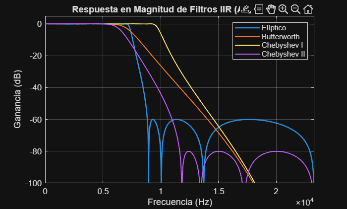
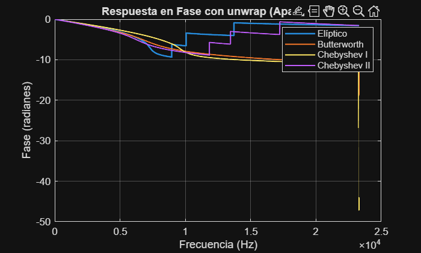
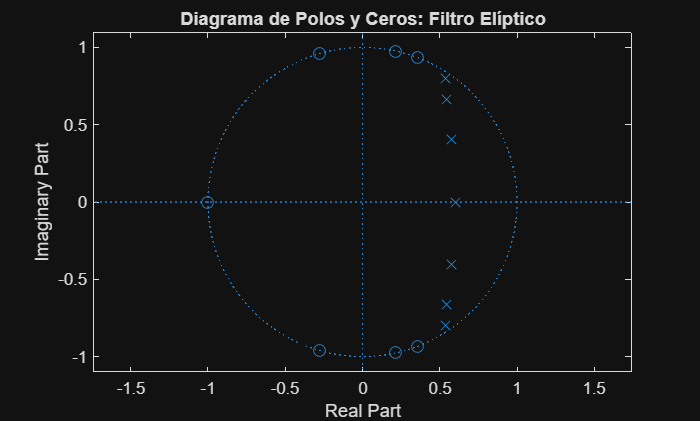

# Práctica 4 - Filtros Digitales IIR

**Asignatura:** Laboratorio de Procesado Digital de Señal - 3º GITT

---

## 1. Diseño de Filtros IIR

En esta sección se han diseñado cuatro filtros paso bajo con los parámetros facilitados.

**Parámetros utilizados:**

* Frecuencia de muestreo ($Fs$): 46 600 Hz
* Orden del filtro ($M$): 7
* Frecuencia de paso ($f$): 7 100 Hz
* Atenuación ($Apass$): 0.1000 dB
* Atenuación ($Astop$): 60 dB

a) IIR – Elliptic

b) IIR – Butterworth

c) IIR – Chebyshev Type I

d) IIR – Chebyshev Type II


Una vez creados los filtros, para poder usar sus coeficientes en adelante, se cargarán al principio de cada fichero de la siguiente manera:
```matlab
load('coef_b.mat')
load('coef_c_I.mat')
load('Filtro_CII.mat')
load('coef_e.mat')
```


---

## 2. Análisis de Filtros: Módulo y Fase

### a) Diferencias en la ganancia (Magnitud)

Tras obtener la respuesta en frecuencia con la función `freqz` utilizando 5000 puntos, se observan las siguientes diferencias:

* **Butterworth:** Es el más plano en la banda de paso, pero su caída es la más lenta.
* **Chebyshev I:** Presenta rizado en la banda de paso y una caída más rápida que el Butterworth.
* **Chebyshev II:** Presenta banda de paso plana y rizado en la banda eliminada.
* **Elíptico:** Es el más selectivo (caída más abrupta), pero tiene rizado tanto en banda de paso como en eliminada.

Código de Matlab:

```matlab
% Obtenemos la respuesta en frecuencia de los cuatro filtros diseñados
N_puntos = 50000; % Usamos N_puntos (50 000) y la frecuencia de muestreo Fs

[Hb, f_vec] = freqz(Num_b, Den_b, N_puntos, Fs);      % Butterworth
[HcI, ~]    = freqz(Num_c_I, Den_c_I, N_puntos, Fs);  % Chebyshev I
[HcII, ~]   = freqz(Num_CII, Den_CII, N_puntos, Fs);  % Chebyshev II
[He, ~]     = freqz(Num_e, Den_e, N_puntos, Fs);      % Elíptico

% Representación de la Magnitud en dB
figure;
plot(f_vec, 20*log10(abs(He)), 'LineWidth', 1.5); hold on;
plot(f_vec, 20*log10(abs(Hb)), 'LineWidth', 1.2);
plot(f_vec, 20*log10(abs(HcI)), 'LineWidth', 1.2);
plot(f_vec, 20*log10(abs(HcII)), 'LineWidth', 1.2);
grid on;
title('Respuesta en Magnitud de Filtros IIR (Apartado a)');
xlabel('Frecuencia (Hz)');
ylabel('Ganancia (dB)');
legend('Elíptico', 'Butterworth', 'Chebyshev I', 'Chebyshev II');
axis([0 Fs/2 -100 5]); % Ajuste de ejes para ver el detalle del rizado y caída
```



### b) Diferencias en la fase

Utilizando la función `unwrap`, se observa que:

* Ningún filtro IIR tiene fase lineal.
* El filtro elíptico es el que presenta variaciones de fase más bruscas en la banda de transición, lo que implica una mayor distorsión de retardo en esa zona. El Butterworth es el que tiene la fase más suave.

Código de Matlab:

```matlab
% Se utiliza la función unwrap para eliminar los saltos de fase de ±pi
% Aprovechamos los vectores calculados en la celda anterior

figure;
plot(f_vec, unwrap(angle(He)), 'LineWidth', 1.5); hold on;
plot(f_vec, unwrap(angle(Hb)), 'LineWidth', 1.2);
plot(f_vec, unwrap(angle(HcI)), 'LineWidth', 1.2);
plot(f_vec, unwrap(angle(HcII)), 'LineWidth', 1.2);
grid on;
title('Respuesta en Fase con unwrap (Apartado b)');
xlabel('Frecuencia (Hz)');
ylabel('Fase (radianes)');
legend('Elíptico', 'Butterworth', 'Chebyshev I', 'Chebyshev II');
```



---

## 3. Polos y Ceros

**a) Represente, en ejes independientes dentro de una misma figura, el diagrama de polos y ceros de los filtros IIR diseñados en el primer bloque de apartados.
Para evitar errores en la representación, emplee la función zplane con la raíces de los polinomios que forman los coeficientes a y b de cada uno de los filtros.**

```matlab
B = {Num_b, Num_c_I, Num_CII, Num_e};   % numeradores
A = {Den_b, Den_c_I, Den_CII, Den_e};   % denominadores
nombres = {"Butterworth", "Chebyshev Type I", "Chebyshev Type II", "Elliptic"};

N = 4; % Número de filtros que tenemos

figure;
for k = 1:N
    subplot(N,1,k);
    z = roots(B{k});
    p = roots(A{k});
    zplane(z,p);
    title(sprintf('Diagrama polos-ceros Filtro %s',nombres{k}));
    grid on;
end
```

* Representación del diagrama de polos y ceros:


**b) ¿Son estables los filtros? ¿Por qué?**

Previamente, con la representación de los filtros en módulo y fase se pudo afirmar que estos eran causales (obsérvese que sus fases son negativas). Esto nos permitirá poder determinar la estabilidad de los filtros en función de si todos los polos del filtro (y más importante aún, el más alejado del origen) se encuentran contenidos en la circunferencia unidad.
La ROC irá hacia fuera (por ser causal) a partir del polo más alejado y si este es menor que 1 (circunferencia unidad), nos aseguraríamos que la ROC contiene a la circunferencia unidad y por lo tanto, es **ESTABLE**.

El código para determinar si nuestros cuatro filtros son estables es el siguiente:
```matlab
for k = 1:N
    p = roots(A{k});

    if all(abs(p) < 1)
        disp((sprintf('El filtro %s es estable', nombres{k})));
    else
        disp((sprintf('El filtro %s NO es estable', nombres{k})));
    end   
end
```

Quedando demostrado que los cuatro filtros creados son estables:


**c) Justifique, a partir del diagrama de polos y ceros, por qué son filtros paso bajo.**

Partimos leyendo desde un ángulo (frecuencia) cero en los diagramas mostrados anteriormente y, según vaya encontrado polos (lo primero que encuentro) ello hace que la amplitud de mi filtro tienda a infinito (no a cero) y que por lo tanto, aumentan mi banda de paso. En el momento en que, recorriendo la circunferencia y aumentando la frecuencia, encuentro mi primer cero, justo en ese instante se produce el cambio entre la banda de paso y la banda eliminada (manteniéndonos en dicha banda eliminada hasta llegar a pi). 

Destacar que la representación es simétrica con respecto al eje real (x) por el hecho de trabajar con filtros reales, donde los polos y los ceros aparecen a pares como complejos conjugados. Es por este hecho que solo estudiamos de 0 a pi, porque lo que hay entre pi y 2pi es idéntico y no aporta información novedosa para el caso concreto.
Además, pi es nuestra última frecuencia digital (la frecuencia de Nyquist).


**d) Justificación matemática de los máximos de oscilación (Filtro Elíptico):**


**e) Justificación matemática de las frecuencias eliminadas:**

Justificación matemática:
La función de transferencia de un filtro digital en el dominio Z viene dada por:

$$
H(z) = G \cdot \frac{\prod_{i=1}^{M} (z - z_i)}{\prod_{k=1}^{M} (z - p_k)}
$$

donde zi son los ceros del filtro (raíces del numerador Num_e).

Cuando el filtro se evalúa en la circunferencia unidad (z=e^jω), si un cero zi se encuentra exactamente sobre dicha circunferencia (∣zi∣=1), la distancia entre el punto de evaluación y el cero se hace cero. Esto provoca que el numerador de la expresión sea igual a cero y, por tanto: ∣H(e^jω)∣ = 0    (−∞dB).

En el filtro elíptico, estos ceros se sitúan estratégicamente en la banda eliminada para crear los "valles" de las oscilaciones y asegurar que la atenuación mínima Astop se mantenga. La frecuencia en Hz a la que esto ocurre se calcula mediante la relación entre el ángulo del cero (θi) y la frecuencia de muestreo (Fs):

$$
f_i = \frac{\text{angle}(z_i) \cdot Fs}{2\pi}
$$

**Conclusión**:
Las frecuencias calculadas mediante las raíces del numerador coinciden exactamente con los valles o "notches" observados en la respuesta en frecuencia (apartado de Módulo y fase). En la gráfica de magnitud, estos puntos son los mínimos locales donde la ganancia cae bruscamente hacia −∞ dB (o valores muy bajos limitados por la precisión numérica). En el diagrama de polos y ceros, estos se visualizan como los círculos ('o') situados justo encima de la línea del círculo unidad en la zona de altas frecuencias.

Código de Matlab:

```matlab
% Las frecuencias eliminadas corresponden a los ceros situados sobre el círculo unidad.

% 1. Calculamos las raíces del numerador (ceros) del filtro elíptico
ceros_e = roots(Num_e);

% 2. Obtenemos el ángulo (fase) de los ceros en radianes
angulos_ceros = angle(ceros_e);

% 3. Convertimos los ángulos a frecuencias en Hz: f = (ang * Fs) / (2*pi)
% Filtramos solo los ángulos positivos para no repetir frecuencias simétricas
f_eliminadas = sort(angulos_ceros(angulos_ceros > 0)) * Fs / (2*pi);

% 4. Mostramos los resultados
fprintf('Las frecuencias eliminadas (ceros de transmisión) son:\n');
for i = 1:length(f_eliminadas)
    fprintf('Frecuencia %d: %.2f Hz\n', i, f_eliminadas(i));
end

% Visualización para comprobación
figure;
zplane(Num_e, Den_e);
title('Diagrama de Polos y Ceros: Filtro Elíptico');
```



---

## 4. Estabilidad
**a) Modificar el filtro elíptico multiplicando sus polos por un factor de 0.95:**
```matlab
% Obtención polos y ceros
poles = roots(Den_e);
zeros = roots(Num_e);

poles_095 = 0.95 * poles;

% Reconstrucción del denominador en función de los nuevos polos
Den_095 = poly(poles_095);
Num_095 = Num_e


% Para obtener un filtro más estable, se ha modificado el filtro elíptico original multiplicando la localización de sus polos por un factor 0.95.
% Al acercar los polos al origen, el módulo de todos ellos disminuye y se mejora la estabilidad del filtro.
```

**b) Coeficientes del filtro modificado (Factor 0.95):**
```matlab
% Mostrar resultados por pantalla
disp('-----------------------------------------------');
disp('Coeficientes del filtro modificado (polos × 0.95)');
disp('Numerador (b):');
disp(Num_095);

disp('Denominador (a):');
disp(Den_095);
disp('-----------------------------------------------');

```

* a =  1.0000   -3.7155    7.0342   -8.2342    6.3696   -3.2217    0.9866   -0.1414
* b =  0.0073    0.0030    0.0152    0.0122    0.0122    0.0152    0.0030    0.0073

**c) Modificar el filtro elíptico multiplicando sus polos por un factor de 1,05:**
```matlab
% Los polos del origen → mayor selectividad → riesgo de inestabilidad.
poles_105 = 1.05 * poles;
Den_105 = poly(poles_105);
Num_105 = Num_e;
```

**d) Coeficientes del filtro modificado (Factor 1.05):**
```matlab
% Mostrar resultados
disp('-----------------------------------------------');
disp('Coeficientes del filtro modificado (polos × 1.05)');
disp('Numerador (b):');
disp(Num_105);

disp('Denominador (a):');
disp(Den_105);
disp('-----------------------------------------------');
```


* a =  1.0000   -4.1066    8.5930  -11.1179    9.5054   -5.3139    1.7986   -0.2850
* b =  0.0073    0.0030    0.0152    0.0122    0.0122    0.0152    0.0030    0.0073

**e) Calcule la respuesta impulsional del filtro original y los dos filtros nuevos**
```matlab
% Cálculo de las respuestas impulsionales
[h_orig, t_orig] = impz(Num_e,   Den_e);
[h_095,  t_095 ] = impz(Num_095, Den_095);
[h_105,  t_105 ] = impz(Num_105, Den_105);


% Mostrar resultado por texto
disp('-----------------------------------------------');
disp('Respuesta impulsional calculada para los tres filtros.');
disp('Vectores h_orig, h_095, h_105 almacenan las respuestas.');
disp('-----------------------------------------------');
```

**f) Efectos en la respuesta en frecuencia:**
```matlab
%Respuesta en frecuencia de los 3 filtros

Npts = 50000; %por no sobrecargar el ordenador

% Filtro original
[H_orig, w] = freqz(Num_e,   Den_e,   Npts);
% Filtro polos ×0.95
H_095 = freqz(Num_095, Den_095, Npts);
% Filtro polos ×1.05
H_105 = freqz(Num_105, Den_105, Npts);

figure;
plot(w, 20*log10(abs(H_orig)), 'LineWidth', 1.2); hold on;
plot(w, 20*log10(abs(H_095)),  '--', 'LineWidth', 1.2);
plot(w, 20*log10(abs(H_105)),  '-.', 'LineWidth', 1.2);

title('Respuesta en frecuencia de los filtros');
xlabel('Frecuencia (rad/muestra)');
ylabel('Magnitud (dB)');
legend('Original', 'Polos ×0.95', 'Polos ×1.05');
grid on;
```

1. Filtro original

Presenta el rizado característico de los filtros elípticos en la banda de paso.
La transición es muy selectiva.
Los nulos en la banda eliminada aparecen exactamente en las frecuencias esperadas.

2. Filtro con polos ×0.95 (línea discontinua naranja)

Al acercar los polos al origen, la ganancia disminuye y la respuesta se vuelve más amortiguada.
El rizado en banda de paso se reduce notablemente.
La frecuencia de corte se desplaza ligeramente hacia una transición menos brusca, perdiendo selectividad.
En la banda eliminada, el nivel de atenuación mejora ligeramente pero los nulos se mantienen en la misma frecuencia.

3. Filtro con polos ×1.05 (línea a trazos amarilla)

Al alejar los polos hacia el borde del círculo unitario, la magnitud aumenta y la respuesta se vuelve más agresiva.
Aparece un rizado mucho mayor en la banda de paso, llegando incluso a valores superiores a +10 dB.
La transición se hace más estrecha, lo que implica mayor selectividad, pero también mayor sensibilidad numérica.
La banda eliminada mantiene los nulos, pero la pendiente es más pronunciada.

Conclusión:

Polos más cerca del origen → respuesta más suave y estable.
Polos más cerca del borde del círculo unitario → respuesta más selectiva pero menos estable.
El filtro con polos ×1.05 muestra claramente un comportamiento que indica pérdida de estabilidad.


**g) Efectos en el diagrama de polos y ceros:**
```matlab
% Diagramas de polos y ceros

figure;

subplot(1,3,1);
zplane(Num_e, Den_e);
title('Original');

subplot(1,3,2);
zplane(Num_095, Den_095);
title('Polos ×0.95');

subplot(1,3,3);
zplane(Num_105, Den_105);
title('Polos ×1.05');
```

1. Filtro original

Los polos están situados dentro del círculo unitario.
La distribución es simétrica respecto al eje real, como corresponde a un filtro IIR estable con coeficientes reales.
Los ceros están correctamente ubicados para producir los nulos en la banda eliminada.

2. Filtro con polos ×0.95

Todos los polos se desplazan hacia el centro del círculo unitario.
Este desplazamiento incrementa la estabilidad del filtro, ya que reduce su módulo.
La respuesta será más amortiguada, lo que ya se ha visto en la respuesta en frecuencia y en la respuesta impulsional.

3. Filtro con polos ×1.05

Los polos se desplazan hacia el exterior, muy próximos al borde del círculo unitario.
Visualmente, los polos quedan peligrosamente cerca de |z| = 1, y es posible que alguno lo cruce con errores numéricos → filtro inestable.
Este comportamiento coincide con la respuesta impulsional creciente del apartado (h).

Conclusión

0.95× polos → filtro más estable
1.05× polos → filtro casi o totalmente inestable
Los diagramas confirman exactamente los efectos observados en la respuesta en frecuencia y en la respuesta impulsional.

**h) Efectos en la respuesta impulsional:**

```matlab
% Respuesta impulsional de los 3 filtros

[h_orig, t_orig] = impz(Num_e,   Den_e);
[h_095,  t_095 ] = impz(Num_095, Den_095);
[h_105,  t_105 ] = impz(Num_105, Den_105);

figure;

subplot(3,1,1);
stem(t_orig, h_orig, 'filled');
title('Respuesta impulsional - Original');
xlabel('n'); ylabel('h[n]'); grid on;

subplot(3,1,2);
stem(t_095, h_095, 'filled');
title('Respuesta impulsional - Polos ×0.95');
xlabel('n'); ylabel('h[n]'); grid on;

subplot(3,1,3);
stem(t_105, h_105, 'filled');
title('Respuesta impulsional - Polos ×1.05');
xlabel('n'); ylabel('h[n]'); grid on;
```

1. Respuesta impulsional del filtro original

La amplitud inicial es moderada y las oscilaciones decaen progresivamente.
El filtro es estable y su respuesta al impulso lo refleja con una energía decreciente.
La duración de la respuesta es intermedia.

2. Respuesta impulsional del filtro con polos ×0.95

La energía decae mucho más rápido que en el filtro original.
Las oscilaciones desaparecen antes, indicando un mayor amortiguamiento.
La respuesta es más corta en el tiempo.
Esto corresponde exactamente a unos polos más cercanos al origen → estabilidad reforzada.

3. Respuesta impulsional del filtro con polos ×1.05

La amplitud crece en valor absoluto hasta alcanzar órdenes de magnitud enormes.
La señal no decae: al contrario, diverge, lo cual es indicativo de inestabilidad.
Esta gráfica confirma que al multiplicar los polos por 1.05, uno o más de ellos ha superado el radio unidad o se ha acercado tanto que provoca crecimiento explosivo por acumulación numérica.

Conclusión

Original → estable y de decaimiento moderado.
Polos ×0.95 → muy estable, decaimiento rápido.
Polos ×1.05 → inestable, crecimiento exponencial.
La respuesta impulsional valida de forma clara la relación entre la estabilidad y la ubicación de los polos en el plano z.
