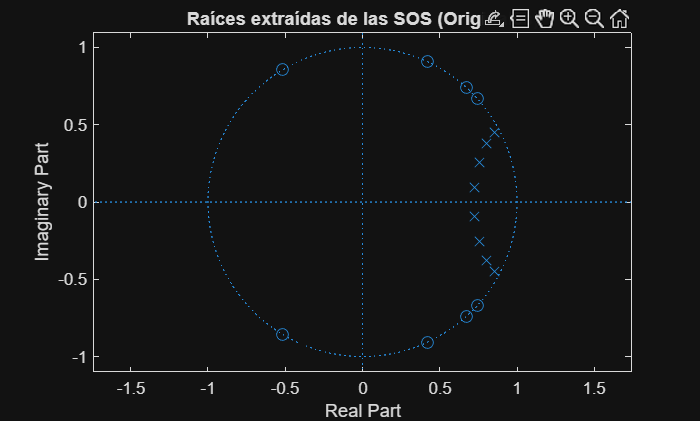
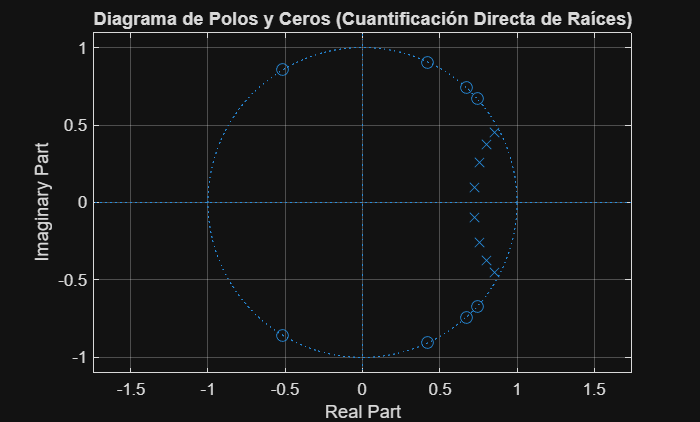
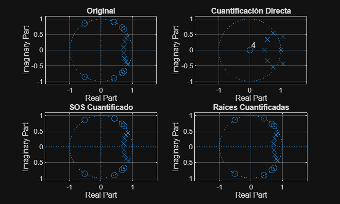

# Práctica 5 - Efectos de la precisión finita en el diseño de filtros digitales

**Asignatura:** Laboratorio de Procesado Digital de Señal - 3º GITT

---

## **Cargar parámetros del filtro (Especificaciones)**

```matlab
if exist('PDS_P5_3A_LE2_G4.mat', 'file')
    load('PDS_P5_3A_LE2_G4.mat');
    fprintf('Parámetros cargados: M=%d, Fs=%.0f, Fpass=%.0f, Apass=%.1f, Astop=%.1f\n', ...
            M, Fs, f, Apass, Astop);
else
    error('El archivo PDS_P5_3A_LE2_G4.mat no se encuentra en la carpeta actual.');
end
```

## 1. Cuantificación de los coeficientes de un filtro

**a) Obtenga los coeficientes a y b de un filtro IIR paso bajo con las siguientes características: Tipo: Lowpass, Método: Elliptic, Orden: M, Fs: Fs, Fpass: f, Apass: Apass, Astop: Astop.**

Procedemos a crear el filtro escribiendo en la línea de comandos 'fdatool'.
De ahí obtenemos los coeficientes, los cuales están subidos como 'coeficientes.mat'.

```matlab
% Cargar coeficientes del filtro (b y a)
if exist('coeficientes.mat', 'file')
    load('coeficientes.mat');
    disp('Coeficientes b (numerador) y a (denominador) cargados correctamente.');
    % Mostrar tamaño de los vectores para verificar
    fprintf('Longitud de b: %d, Longitud de a: %d\n', length(b), length(a));
else
    error('El archivo coeficientes.mat no se encuentra en la carpeta actual.');
end
```

**b) Cuantifique los coeficientes a y b con B = 16 bits, de los cuales D = 8 bits corresponden a la parte decimal. Use las propiedades ‘fixed’, ‘round’ y ‘saturate’ de la función quantizer.**

```matlab
% D = 8 bits (parte decimal), B = 16 bits
% I = 7

q = quantizer('fixed', 'round', 'saturate', [16, 8]);
a_q = quantize(q,a);
b_q = quantize(q,b);
```

Procedemos a representar en módulo y fase para poder ver cómo cambian antes y después de cuantificar:

```matlab
%%%%% COMPARACIÓN MÓDULOS:

% Respuesta en frecuencia
[H,f]  = freqz(b,  a, 1024, Fs);     % filtro original
[Hq,~] = freqz(b_q,a_q,1024, Fs);    % filtro cuantificado

% Gráfica
figure
plot(f, 20*log10(abs(H)),  'b','LineWidth',1.5)
hold on
plot(f, 20*log10(abs(Hq)), 'r','LineWidth',1.5)
grid on

xlabel('Frecuencia (Hz)')
ylabel('Magnitud (dB)')
title('Respuesta en frecuencia (0 – Fs/2)')
legend('Filtro original','Filtro cuantificado')
xlim([0 Fs/2])

%%%%% COMPARACIÓN FASES:

fase  = unwrap(angle(H));
faseq = unwrap(angle(Hq));

% Gráfica de fase
figure
plot(f, fase*180/pi,  'b','LineWidth',1.5)
hold on
plot(f, faseq*180/pi, 'r','LineWidth',1.5)
grid on

xlabel('Frecuencia (Hz)')
ylabel('Fase (grados)')
title('Respuesta en fase (0 – Fs/2)')
legend('Filtro original','Filtro cuantificado')
xlim([0 Fs/2])

%%%%% COMPARACIÓN CEROS (Estabilidad del filtro):

% Todos los ceros están en el mismo punto (respuesta bastante plana)

B = {b, b_q};   % numeradores
A = {a, a_q};   % denominadores
nombres = {"Original", "Cuantificado"};

N = 2; % Número de filtros que tenemos

figure;
for k = 1:N
    subplot(N,1,k);
    z = roots(B{k});
    p = roots(A{k});
    zplane(z,p);
    title(sprintf('Diagrama polos-ceros Filtro %s',nombres{k}));
    grid on;
end

```

Obteniendo así las siguientes gráficas:


Al cuantificar, cambia por completo la respuesta en frecuencia.
* Podemos ver cómo el módulo se aplana. Dejamos de apreciar los ceros con claridad.
* Se han podido mover los ceros (crecida la distancia entre el vector y la circunferencia unidad. Lo que aplana el filtro, haciendo que deje de ser tan selectivo. Pierde ese efecto de fase localizado que tenía el cero).
* Viendo la fase, comprobamos cómo perdemos esos saltos de fase.

Como tenía pocos bits, lo he perdido. NO tengo la suficiente precisión para poder representar la posición de los ceros que estaban originalmente en la circunferencia unidad.

---

## 2. Secciones de Segundo Orden (SOS)

**a) Calcule las Secciones de Segundo Orden del filtro IIR diseñado en el bloque anterior mediante la función tf2sos.**

Con el objetivo de reducir el efecto de la cuantificación de los coeficientes del filtro IIR diseñado, se procede a su descomposición en Secciones de Segundo Orden (SOS). Este método permite que cada coeficiente afecte únicamente a una raíz o a un par de raíces complejas conjugadas, mejorando así la robustez del filtro frente a errores de cuantificación.

A partir de los coeficientes del numerador b y del denominador a, calculados en el bloque anterior, se han obtenido las Secciones de Segundo Orden utilizando la función tf2sos de Matlab, que devuelve la matriz sos y una ganancia asociada g.

**Código de Matlab:**

```matlab
% Cargar coeficientes del filtro original
load PDS_P5_3A_LE2_G4.mat
load coeficientes.mat   % variables: b (numerador) y a (denominador)

% Cálculo de las Secciones de Segundo Orden
[sos, g] = tf2sos(b, a);

disp('Matriz de Secciones de Segundo Orden (sos):');
disp(sos);

% Estructura de sos:
%Cada fila tiene la forma:
% [b0i b1i b2i 1 a1i a2i]

disp('Ganancia asociada al filtro:');
disp(g);
```

**b) Cuantifique cada uno de los coeficientes de la matriz de Secciones de Segundo Orden con el mismo cuantificador empleado en el bloque anterior (B = 16 bits, D = 8 bits).**

Posteriormente, se han cuantificado todos los coeficientes de la matriz de Secciones de Segundo Orden empleando un cuantificador de tipo fijo con 16 bits totales, de los cuales 8 corresponden a la parte fraccionaria, utilizando redondeo y saturación. La cuantificación se ha realizado coeficiente a coeficiente para cada sección.

Finalmente, se ha comparado la respuesta en frecuencia del filtro original expresado en SOS con la del filtro cuyas Secciones de Segundo Orden han sido cuantificadas, observándose una menor degradación de la respuesta en comparación con la cuantificación directa de los coeficientes a y b.

**Código de Matlab:**

```matlab
% Parámetros del cuantificador
B = 16;   % bits totales
D = 8;    % bits decimales

q = quantizer('fixed', 'round', 'saturate', [B D]);

% Inicialización
sos_q = zeros(size(sos));

% Cuantificación de cada coeficiente SOS
for i = 1:size(sos,1)
    for j = 1:size(sos,2)
        sos_q(i,j) = bin2num(q, num2bin(q, sos(i,j)));
    end
end

disp('Matriz SOS cuantificada:');
disp(sos_q);
% sos_q contiene las Secciones de Segundo Orden cuantificadas

num = 50000;

% Respuesta en frecuencia del filtro original (SOS)
[H_sos, f] = freqz(sos, num, Fs);

% Respuesta en frecuencia del filtro SOS cuantificado
[H_sos_q, ~] = freqz(sos_q, num, Fs);

% Representación
figure;
plot(f, 20*log10(abs(H_sos)), 'b','LineWidth',1.2);
hold on;
plot(f, 20*log10(abs(H_sos_q)), 'r--','LineWidth',1.2);
grid on;

title('Respuesta en frecuencia - Secciones de Segundo Orden');
xlabel('Frecuencia (Hz)');
ylabel('Ganancia (dB)');
legend('SOS original', 'SOS cuantificado');

xlim([0 Fs/2]);
```


---

## 3. Raíces en Secciones de Segundo Orden

*Responsable: [TU NOMBRE]*

### **a) Calcule las raíces de cada Sección de Segundo Orden del filtro original obtenidas en el bloque anterior.**

Para descomponer el filtro y analizar su sensibilidad, extraemos las raíces de la matriz SOS original. Cada fila de esta matriz representa una sección de segundo orden. Los ceros se obtienen de los coeficientes del numerador (columnas 1 a 3) y los polos de los coeficientes del denominador (columnas 4 a 6). Al obtener las raíces sección por sección, se minimizan los errores de precisión numérica que aparecen al calcular raíces de polinomios de alto orden, ya que solo tratamos con polinomios cuadráticos.

**Código de Matlab:**

```matlab
% Obtenemos las dimensiones de la matriz SOS (proporcionada por el bloque 2)
[L, ~] = size(sos);
ceros_originales = [];
polos_originales = [];

% Extraemos raíces de cada sección individualmente
for i = 1:L
    % Raíces del numerador [b0i, b1i, b2i]
    ceros_originales = [ceros_originales; roots(sos(i, 1:3))];
    % Raíces del denominador [1, a1i, a2i]
    polos_originales = [polos_originales; roots(sos(i, 4:6))];
end

% Vector total de raíces originales (polos + ceros) para comparación
raices_total_original = [ceros_originales; polos_originales];

% Ver los resultados
disp('--- CEROS ORIGINALES ---');
disp(ceros_originales);
disp('--- POLOS ORIGINALES ---');
disp(polos_originales);

% Gráfico
figure('Name', 'Raíces Originales de las SOS');
zplane(ceros_originales, polos_originales);
title('Raíces extraídas de las SOS (Originales)');
```

CEROS ORIGINALES

   -0.5161 + 0.8565i
   -0.5161 - 0.8565i
   0.4206 + 0.9072i
   0.4206 - 0.9072i
   0.6721 + 0.7405i
   0.6721 - 0.7405i
   0.7418 + 0.6707i
   0.7418 - 0.6707i

POLOS ORIGINALES

   0.7253 + 0.0934i
   0.7253 - 0.0934i
   0.7552 + 0.2585i
   0.7552 - 0.2585i
   0.8004 + 0.3761i
   0.8004 - 0.3761i
   0.8526 + 0.4473i
   0.8526 - 0.4473i



### **b) Cuantifique cada una de las raíces con el mismo cuantificador empleado en los bloques anteriores (B = 16 bits, D = 8 bits).**

En este apartado se aplica la cuantificación directamente sobre la posición de las raíces (ceros y polos) en el plano Z. Este método es el más robusto de los tres, ya que al fijar la posición de la raíz, evitamos que pequeños errores en los coeficientes del polinomio desplacen las raíces de forma impredecible. Se utiliza un cuantificador de punto fijo con 8 bits para la parte decimal.

**Código de Matlab:**

```matlab
% Definición del cuantificador según especificaciones (B=16, D=8)
q = quantizer('fixed', 'round', 'saturate', [16 8]);

% Cuantificación del vector de raíces (Paso a binario y reconversión a decimal)
raices_q_metodo3 = bin2num(q, num2bin(q, raices_total_original));

% Separamos ceros y polos cuantificados para el análisis gráfico
ceros_q_raices = raices_q_metodo3(1:length(ceros_originales));
polos_q_raices = raices_q_metodo3(length(ceros_originales)+1:end);
disp('Primeras 5 raíces cuantificadas (Parte Real + Imag):');
disp(raices_q_metodo3(1:5));

% Generar gráfica de este apartado
figure('Name', 'Apartado 3b: Raíces Cuantificadas');
zplane(ceros_q_raices, polos_q_raices);
title('Diagrama de Polos y Ceros (Cuantificación Directa de Raíces)');
grid on;
```

  Primeras 5 raíces cuantificadas (Parte Real + Imag):

  -0.5156 + 0.8555i
  -0.5156 - 0.8555i
   0.4219 + 0.9062i
   0.4219 - 0.9062i
   0.6719 + 0.7422i



---

## 4. Análisis General

*Responsable: [TU NOMBRE] (a y d) / Compañeros (b y c)*

### **a) Calcule el error cuadrático medio (ECM) de las raíces (polos y ceros) de cada uno de los tres filtros cuantificados, con el filtro original. Indique el valor obtenido.**

El ECM mide la desviación promedio de las raíces cuantificadas respecto a su posición ideal. Se calcula mediante la expresión:

$$
ECM = \frac{1}{n} \cdot \sum_{i=1}^{n} |r_i - \hat{r}_i|^2
$$

Donde $r_i$ son las raíces originales y $\hat{r}_i$ las cuantificadas.

**Código de Matlab:**

```matlab
% 1. Definir la referencia (debe estar ordenada para comparar correctamente)
ref = sort(raices_total_original);
N_ref = length(ref);

% 2. Raíces del Filtro con Coeficientes Directos (C1)
r_directas = [roots(b_q); roots(a_q)];
% Si el tamaño no coincide, rellenamos con ceros hasta llegar a N_ref
if length(r_directas) < N_ref
    r_directas = [r_directas; zeros(N_ref - length(r_directas), 1)];
end
raices_q_directas_sorted = sort(r_directas);

% 3. Raíces del Filtro SOS Cuantificado (C2)
raices_q_sos_temp = [];
for i = 1:size(sos_q, 1)
    raices_q_sos_temp = [raices_q_sos_temp; roots(sos_q(i, 1:3)); roots(sos_q(i, 4:6))];
end
raices_q_sos_sorted = sort(raices_q_sos_temp);

% 4. Raíces Cuantificadas directamente (C3)
raices_q_metodo3_sorted = sort(raices_q_metodo3);

% --- Cálculo de ECM (ahora todos miden lo mismo y están ordenados) ---
ecm_metodo1 = (1/N_ref) * sum(abs(ref - raices_q_directas_sorted).^2);
ecm_metodo2 = (1/N_ref) * sum(abs(ref - raices_q_sos_sorted).^2);
ecm_metodo3 = (1/N_ref) * sum(abs(ref - raices_q_metodo3_sorted).^2);

fprintf('ECM Cuantificación Directa: %e\n', ecm_metodo1);
fprintf('ECM Cuantificación SOS: %e\n', ecm_metodo2);
fprintf('ECM Cuantificación de Raíces: %e\n', ecm_metodo3);
```

- ECM Cuantificación Directa: 1.144586e+00
- ECM Cuantificación SOS: 7.016206e-01
- ECM Cuantificación de Raíces: 6.608503e-01

**b) Analice las diferencias en la ganancia en función de la frecuencia (dB vs Hz) utilizando la función freqz con 50.000 puntos.**

```matlab
% Reconstrucción del filtro con raíces cuantificadas
b_raices_q = real(poly(ceros_q_raices));
a_raices_q = real(poly(polos_q_raices));

num = 50000;

% 1. Filtro original
[H_orig, f] = freqz(b, a, num, Fs);

% 2. Filtro con coeficientes cuantificados a y b
[H_ab_q, ~] = freqz(b_q, a_q, num, Fs);

% 3. Filtro SOS cuantificado
[H_sos_q, ~] = freqz(sos_q, num, Fs);

% 4. Filtro con raíces cuantificadas
[H_raices_q, ~] = freqz(b_raices_q, a_raices_q, num, Fs);


figure;
plot(f, 20*log10(abs(H_orig)), 'k','LineWidth',1.5); hold on;
plot(f, 20*log10(abs(H_ab_q)), 'r--','LineWidth',1.2);
plot(f, 20*log10(abs(H_sos_q)), 'b-.','LineWidth',1.2);
plot(f, 20*log10(abs(H_raices_q)), 'g:','LineWidth',1.5);

grid on;
xlim([0 Fs/2]);

title('Análisis de ganancia en frecuencia');
xlabel('Frecuencia (Hz)');
ylabel('Ganancia (dB)');
legend('Filtro original', ...
       'Coeficientes a y b cuantificados', ...
       'SOS cuantificado', ...
       'Raíces cuantificadas', ...
       'Location', 'Best');
```


En este apartado se ha analizado el efecto de la cuantificación sobre la ganancia en función de la frecuencia de cuatro implementaciones del mismo filtro digital: el filtro original, el filtro con coeficientes a y b cuantificados, el filtro implementado mediante Secciones de Segundo Orden cuantificadas y el filtro reconstruido a partir de raíces cuantificadas. Para todos los casos se ha obtenido la respuesta en frecuencia utilizando la función freqz con 50 000 puntos, representándose la ganancia en decibelios frente a la frecuencia en hercios.
El filtro con coeficientes a y b cuantificados es el que presenta mayores desviaciones respecto al filtro original, especialmente visibles en la banda de paso y en la atenuación de la banda de rechazo. En cambio, la implementación mediante Secciones de Segundo Orden cuantificadas muestra una respuesta mucho más próxima a la ideal, ya que la cuantificación afecta de forma localizada a cada sección.
Finalmente, el filtro construido a partir de raíces cuantificadas es el que mejor conserva la respuesta espectral original, al actuar la cuantificación directamente sobre la posición de polos y ceros. Este análisis confirma que tanto la estructura en Secciones de Segundo Orden como la cuantificación de raíces reducen significativamente el impacto de los errores de cuantificación frente a la cuantificación directa de los coeficientes.

**c) Analice las diferencias en la fase en función de la frecuencia utilizando la función unwrap.**

Procedemos a representar gráficamente las cuatro fases:
```matlab
% Representando las fases de todos mi métodos usados:

num  = 50000;        % resolución en frecuencia

% 1. Filtro original
[H_orig, f] = freqz(b, a, num, Fs);

% 2. Filtro con coeficientes cuantificados a y b
[H_ab_q, ~] = freqz(b_q, a_q, num, Fs);

% 3. Filtro SOS cuantificado
[H_sos_q, ~] = freqz(sos_q, num, Fs);

% 4. Filtro con raíces cuantificadas
[H_raices_q, ~] = freqz(b_raices_q, a_raices_q, num, Fs);


% Fase desenrollada
phi1 = unwrap(angle(H_orig));
phi2 = unwrap(angle(H_ab_q));
phi3 = unwrap(angle(H_sos_q));
phi4 = unwrap(angle(H_raices_q));

figure
plot(f,phi1,'k','LineWidth',1.5); hold on
plot(f,phi2,'r--','LineWidth',1.3)
plot(f,phi3,'b-.','LineWidth',1.3)
plot(f,phi4,'g:','LineWidth',1.5)
grid on

xlabel('Frecuencia (Hz)')
ylabel('Fase (rad)')
title('Comparación de la fase de los cuatro filtros')
legend('Filtro original', ...
       'Coeficientes a y b cuantificados', ...
       'SOS cuantificado', ...
       'Raíces cuantificadas', ...
       'Location', 'Best');
xlim([0 Fs/2])
```

Obteniendo la siguiente representación:


En ella se puede apreciar cómo la cuantificación de coeficientes afecta de manera significativa al comportamiento en fase del filtro. La implementación directa con coeficientes cuantificados presenta desviaciones notables respecto al filtro original, mientras que la estructura en secciones de segundo orden ofrece una mayor robustez frente a la cuantificación. Por el contrario, la cuantificación de raíces resulta la más sensible, produciendo las mayores diferencias de fase, debido a la elevada sensibilidad de la ubicación de polos y ceros a errores numéricos.

Los cuatro guardan la causalidad y en el caso del SOS cuantificado y del Raíces cuantificadas, se puede observar con mayor facilidad dónde están los ceros y dónde se producen esos saltos de fase.

Como conclusión general, podemos afirmar que el mejor método (o el más fiel al original) es el de SOS, mientras que el peor es el de Raíces cuantificadas, ya que presenta saltos, los cuales son consecuencia de desplazamientos significativos de los polos del sistema, lo que provoca grandes variaciones en la fase. 
La cuantificación de raíces es la más sensible a errores numéricos y da lugar a las mayores desviaciones respecto al filtro original, siendo por tanto la peor alternativa desde el punto de vista de la respuesta en fase.


### **d) Analice las diferencias en el diagrama de polos y ceros de los cuatro filtros empleando la función zplane. Exponga y justifique gráficamente las conclusiones.**

El diagrama de polos y ceros permite visualizar la estabilidad y la fidelidad del diseño. En la **cuantificación directa**, los polos de un filtro de orden alto son extremadamente sensibles, y pequeños errores de cuantificación pueden desplazarlos fuera del círculo unidad, haciendo el filtro inestable. En cambio, en las representaciones de **SOS** y **Raíces cuantificadas**, los puntos se mantienen casi idénticos al original. Esto justifica por qué en la práctica industrial se prefieren estructuras SOS para implementar filtros IIR en procesadores de precisión limitada.

**Código de Matlab:**

```matlab
figure;
% 1. Filtro Original
subplot(2,2,1); zplane(ceros_originales, polos_originales);
title('Original'); grid on;

% 2. Cuantificación Directa
subplot(2,2,2); zplane(roots(b_q), roots(a_q));
title('Cuantificación Directa'); grid on;

% 3. SOS Cuantificadas
subplot(2,2,3);
c_sos_q = []; p_sos_q = [];
for i=1:size(sos_q,1)
    c_sos_q = [c_sos_q; roots(sos_q(i,1:3))];
    p_sos_q = [p_sos_q; roots(sos_q(i,4:6))];
end
zplane(c_sos_q, p_sos_q);
title('SOS Cuantificado'); grid on;

% 4. Raíces Cuantificadas
subplot(2,2,4); zplane(ceros_q_raices, polos_q_raices);
title('Raíces Cuantificadas'); grid on;
```


