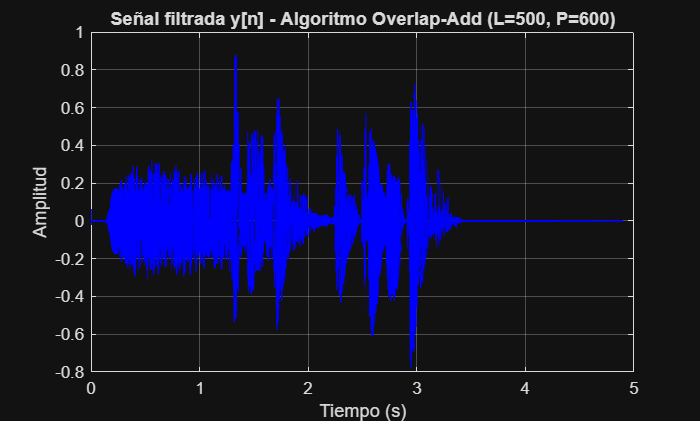
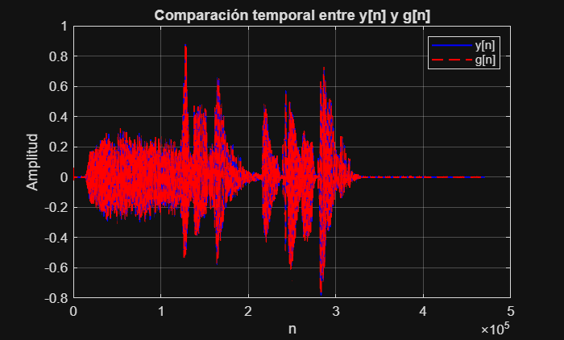
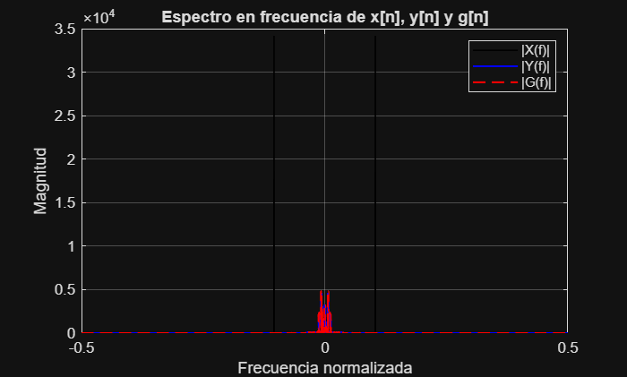

# PRÁCTICA 6: Implementación de filtros LTI utilizando DFT

**Asignatura:** Laboratorio de Procesado Digital de Señal - 3º GITT

**Objetivo:** Filtrar una señal de audio utilizando la Transformada Discreta de Fourier (DFT) mediante el método de solape-almacenamiento (overlap-add).

---

## Carga inicial de parámetros

```matlab
clear; close all; clc;

% Cargar parámetros del filtro especificados en el archivo .mat
if exist('PDS_P6_3A_LE2_G4.mat', 'file')
    load('PDS_P6_3A_LE2_G4.mat');
    fprintf('Parámetros cargados:\n');
    fprintf('  M = %d (orden del filtro)\n', M);
    fprintf('  Apass = %.1f dB (atenuación en banda de paso)\n', Apass);
    fprintf('  Astop = %.1f dB (atenuación en banda de rechazo)\n', Astop);
else
    error('El archivo PDS_P6_3A_LE2_G4.mat no se encuentra en la carpeta actual.');
end
```

---

## BLOQUE 1: Diseño de un filtro FIR

### **a) Lectura y reproducción de la señal de audio**

```matlab
clear;
close all;
clc;

load("PDS_P6_3A_LE2_G4.mat");
% Lectura del archivo de audio
[x, fs] = audioread('PDS_P6_3A_LE2_G4.wav');

% Reproducción del audio (comenzar con volumen bajo)
sound(x, fs);
```

```matlab
fs
Apass
Astop
M
```

**Observaciones sobre la señal de audio:**


---

### **b) Especificación de la frecuencia de muestreo y frecuencia de corte**

```matlab
%% Obtención y representación 
N = length(x);

% FFT normalizada
X = fft(x) / N;

% Eje de frecuencias centrado
f = linspace(-fs/2, fs/2, N);

% Espectro centrado
X_shift = fftshift(abs(X));

figure;
plot(f, fftshift(abs(X)));
grid on;
xlabel('Frecuencia (Hz)');
ylabel('|X(f)|');
title('Espectro en frecuencia de la señal original');

%% Obtencion componentes espectrales de mayor frec
% Umbral para detectar picos relevantes (10% del máximo)
threshold = 0.1 * max(X_shift);

% Índices de componentes relevantes
idx = find(X_shift > threshold);

% Frecuencias correspondientes
freqs_relevantes = f(idx);

% Componente positiva de mayor frecuencia
f_pos_max = max(freqs_relevantes(freqs_relevantes > 0));

% Componente negativa de mayor frecuencia
f_neg_max = min(freqs_relevantes(freqs_relevantes < 0));

% Mostrar resultados
disp(['Componente frecuencial positiva más alta: ', num2str(f_pos_max), ' Hz']);
disp(['Componente frecuencial negativa más alta: ', num2str(f_neg_max), ' Hz']);

%% Frecuencia de corte correcta del filtro paso bajo

% Anchura estimada de la banda de transición del FIR
delta_f = 4*fs/M;

% Frecuencia de corte segura (garantiza que 10 kHz esté en rechazo)
fc = f_pos_max - delta_f/2;

disp(['Frecuencia de corte corregida: ', num2str(fc), ' Hz']);
```

**Justificación:**


> [COMPLETAR POR COMPAÑERO 1]

---

### **c) Diseño del filtro FIR con fdatool**

```matlab
load("filtro_fir.mat");
b = Num;
```

**Justificación:**
Del análisis espectral de la señal se observa la presencia de dos componentes dominantes en ±10 kHz, correspondientes al tono no deseado.
Dado que el filtro a diseñar es de tipo paso bajo, se selecciona una frecuencia de corte inferior a la componente positiva localizada, con un pequeño margen de seguridad.
De este modo se garantiza que dicha componente quede situada en la banda de rechazo del filtro, asegurando su atenuación conforme a la especificación Astop.

---

### **d) Representación de la respuesta en frecuencia del filtro**

```matlab
figure;
freqz(b, 1, 2048, fs);
grid on;
title('Respuesta en frecuencia del filtro FIR diseñado');
```

**Justificación del diseño:**
``

> [COMPLETAR POR COMPAÑERO 1] - Verificar que el filtro cumple con el objetivo de atenuar el tono molesto.

**FILTRADO SEÑAL CON FILTRO NORMAL**

```matlab
% Filtrado de la señal
y = filter(b, a, x);

% Reproducir señal filtrada (opcional)
sound(y, fs);

% Número de muestras a visualizar
Ns = 5000;
n = 0:Ns-1;

figure;
plot(n, x(1:Ns), 'b');
hold on;
plot(n, y(1:Ns), 'r');
grid on;

xlabel('n (muestras)');
ylabel('Amplitud');
title('Señal original vs señal filtrada (dominio temporal)');
legend('x[n] - Original', 'y[n] - Filtrada');


% FFT de ambas señales
X = fft(x) / N;
Y = fft(y) / N;

% Eje de frecuencias
f = linspace(-fs/2, fs/2, N);

% Espectros centrados
X_shift = fftshift(abs(X));
Y_shift = fftshift(abs(Y));

figure;
plot(f, X_shift, 'b');
hold on;
plot(f, Y_shift, 'r');
grid on;

xlabel('Frecuencia (Hz)');
ylabel('|X(f)|');
title('Espectro de la señal antes y después del filtrado');
legend('Original', 'Filtrada');
```


---

## BLOQUE 2: Implementación de un filtro FIR utilizando DFT

### Introducción teórica

La convolución lineal entre una señal de entrada **x[n]** y los coeficientes del filtro **b[n]** puede implementarse de forma eficiente utilizando la Transformada Discreta de Fourier (DFT) en lugar de cálculos directos en el dominio del tiempo.

La ventaja principal es la reducción de complejidad computacional:

- **Convolución directa:** O(N²)
- **Convolución mediante DFT:** O(N·log₂(N))

El algoritmo de **solape-almacenamiento** (overlap-add) consigue que las convoluciones circulares (propias de la DFT) sean equivalentes a convoluciones lineales mediante una gestión adecuada de las muestras de entrada y salida.

---

### **a) Implementación del algoritmo de solape-almacenamiento**

**Parámetros del algoritmo:**

- **L = 500:** Longitud de cada segmento de entrada
- **P = L + M - 1:** Longitud de la DFT (evita aliasing circular)
- **M:** Orden del filtro (longitud de los coeficientes b)

```matlab
% ========== IMPLEMENTACIÓN DEL ALGORITMO DE SOLAPE-ALMACENAMIENTO ==========
% Este algoritmo filtra la señal x_n mediante convolución lineal usando FFT

% 1. Parámetros iniciales del algoritmo
L = 500;                              % Longitud de cada segmento de entrada
M_filt = length(b);                   % Orden del filtro
P = L + M_filt - 1;                   % Longitud de la DFT: P = L + M - 1

% [COMPAÑERO 1 DEBE HABER CARGADO x y fs en el Bloque 1]
% Si no está cargado, cargar aquí:
% [x, fs] = audioread('nombre_archivo.wav');

N_entrada = length(x);                % Longitud total de la señal de entrada

% 2. Preparación del filtro en el dominio de la frecuencia
% Aumentar el filtro b a longitud P con ceros
h_n = [b'; zeros(L, 1)];              % Vector columna de coeficientes padded a P
H_n = fft(h_n, P);                    % Transformada de Fourier del filtro (una sola vez)

% 3. Inicialización de variables
y = [];                               % Vector de salida final
overlap = zeros(M_filt - 1, 1);       % Solapamiento del segmento anterior

% 4. Cálculo del número de segmentos
num_segmentos = ceil(N_entrada / L);

% ========== BUCLE PRINCIPAL: PROCESAR CADA SEGMENTO ==========

for k = 1:num_segmentos
    % 4.1. Extraer segmento de entrada de longitud L
    idx_inicio = (k-1) * L + 1;
    idx_fin = min(k * L, N_entrada);
    x_seg = x(idx_inicio:idx_fin);
  
    % 4.2. Rellenar con ceros si es el último segmento y tiene menos de L muestras
    if length(x_seg) < L
        x_seg = [x_seg; zeros(L - length(x_seg), 1)];
    end
  
    % 4.3. Calcular la FFT del segmento de entrada (relleno a P)
    X_fft = fft(x_seg, P);
  
    % 4.4. Multiplicación en el dominio de la frecuencia
    % Convolución circular = Multiplicación elemento a elemento en frecuencia
    Y_fft = X_fft .* H_n;
  
    % 4.5. Transformada inversa de Fourier (vuelve al dominio del tiempo)
    y_seg_completo = ifft(Y_fft, P);
  
    % 4.6. Tomar la parte real (descartar ruido numérico imaginario)
    y_seg_completo = real(y_seg_completo);
  
    % 4.7. Solape-almacenamiento (Overlap-Add):
    % La convolución y_seg_completo tiene P = L + M - 1 puntos
    % Separamos:
    %   - Primeros (M-1) puntos: solape con el segmento anterior
    %   - Últimos L puntos: salida válida de este segmento
  
    % Sumar el solapamiento anterior a los primeros (M-1) puntos de la salida
    y_seg_completo(1:M_filt-1) = y_seg_completo(1:M_filt-1) + overlap;
  
    % 4.8. Acumular los L puntos válidos de salida
    y = [y; y_seg_completo(1:L)];
  
    % 4.9. Guardar el solapamiento (últimos M-1 puntos) para el siguiente segmento
    overlap = y_seg_completo(L+1:L+M_filt-1);
end

% 5. Descartar el exceso de muestras (si las hay por padding)
y = y(1:N_entrada);

% ========== REPRODUCCIÓN DE LA SEÑAL FILTRADA ==========
fprintf('Reproduciendo señal filtrada con algoritmo overlap-add (L=%d, P=%d)...\n', L, P);
sound(y, fs);

% ========== GRÁFICA: SEÑAL FILTRADA EN EL TIEMPO ==========
figure('Name', 'Señal Filtrada - Método Overlap-Add');
t = (0:length(y)-1) / fs;
plot(t, y, 'LineWidth', 1, 'Color', 'b');
grid on;
title(sprintf('Señal filtrada y[n] - Algoritmo Overlap-Add (L=%d, P=%d)', L, P));
xlabel('Tiempo (s)');
ylabel('Amplitud');
hold off;
```



---

### **b) Código comentado del algoritmo**

**Descripción de las líneas más significativas:**

| Línea                                | Significado                                                     |
| ------------------------------------- | --------------------------------------------------------------- |
| `L = 500`                           | Longitud de cada segmento de entrada (parámetro del algoritmo) |
| `P = L + length(b) - 1`             | Longitud de la DFT (P = L + M - 1, evita aliasing circular)     |
| `num_trozos = floor(...)`           | Número total de segmentos a procesar                           |
| `h_n = [b'; zeros(...)]`            | Filtro b rellenado con ceros hasta longitud P                   |
| `H_n = fft(h_n, ...)`               | Transformada de Fourier del filtro (se calcula una sola vez)    |
| `for k = 1:num_trozos`              | Bucle principal sobre cada segmento de entrada                  |
| `x_seg = x(inicio:fin)`             | Extrae un segmento de L muestras                                |
| `X_fft = fft(x_seg, P)`             | FFT del segmento de entrada (relleno a P)                       |
| `Y_fft = X_fft .* H_n`              | Multiplicación en frecuencia = convolución circular           |
| `y_seg_completo = ifft(Y_fft)`      | Transformada inversa (vuelve al dominio del tiempo)             |
| `y_seg = real(y_seg_completo(...))` | Extrae la parte real y aplica el solapamiento                   |
| `y = [y; y_seg(1:L)]`               | Acumula los L puntos válidos de salida                         |
| `y_anterior = y_seg_completo(...)`  | Almacena el solapamiento para el siguiente tramo                |
| `y = y(1:N_entrada)`                | Recorta la salida a la longitud original                        |

---

### **c) Justificación del parámetro P**

```matlab
% Parámetro P (longitud de la DFT)
P = L + length(b) - 1;

fprintf('\n=== PARÁMETRO P (Longitud de la DFT) ===\n');
fprintf('L (longitud del segmento de entrada) = %d muestras\n', L);
fprintf('M (orden del filtro) = length(b) = %d\n', length(b));
fprintf('P = L + M - 1 = %d + %d - 1 = %d\n\n', L, length(b), P);
```

**=== PARÁMETRO P (Longitud de la DFT) ===**

- L (longitud del segmento de entrada) = 500 muestras
- M (orden del filtro) = length(b) = 101
- P = L + M - 1 = 500 + 101 - 1 = 600

**Justificación matemática:**

La convolución lineal entre un segmento de **L** muestras y un filtro de **M** coeficientes produce una salida de longitud **L + M - 1**. Esto es una propiedad fundamental de la convolución.

Para que la convolución circular (mediante FFT/IFFT) sea **equivalente** a la convolución lineal, la longitud de la FFT debe ser **al menos L + M - 1**.

**¿Por qué es importante?**

- Si P < L + M - 1 → Aliasing circular y resultados incorrectos
- Si P = L + M - 1 → Convolución circular ≡ Convolución lineal ✓ (óptimo)
- Si P > L + M - 1 → Más overhead computacional sin beneficio

En este caso:

$$
P = 500 + M - 1
$$

**Ejemplo numérico:**

- L = 500 muestras de entrada
- M = (depende del orden del filtro diseñado)
- P = 500 + M - 1 ≈ 500 + M - 1

---

## BLOQUE 3: Análisis de resultados

### **a) a) Aplique el filtro FIR diseñado, a la señal original x[n], con la función filter de Matlab. La señal resultante se denominará g[n].**

```matlab
g = filter(b,1,x);
```

---

### **b) Represente en el tiempo y superpuestas en una misma figura las señales y(t) y g(t).**

```matlab
n = 0:length(y)-1;

figure;
plot(n, y, 'b', 'LineWidth', 1.2); hold on;
plot(n, g, 'r--', 'LineWidth', 1.2);
grid on;
legend('y[n]', 'g[n]');
xlabel('n');
ylabel('Amplitud');
title('Comparación temporal entre y[n] y g[n]');
```



---

### **c) Error cuadrático medio (MSE) entre y[n] y g[n]**

```matlab
% Asegurar misma longitud
N = min(length(y), length(g));

% Calcular el ECM
ECM = mean((y(1:N) - g(1:N)).^2);

% Mostrar el resultado
fprintf('El error cuadrático medio entre y[n] y g[n] es: %.6f\n', ECM);

```

- El error cuadrático medio entre y[n] y g[n] es: 0.000000

---

### **d) Comparación del espectro en frecuencia: x[n], y[n] y g[n]**

```matlab
% Longitud FFT
Nfft = max([length(x), length(y), length(g)]);
Nfft = 2^nextpow2(Nfft);

% FFT centrada (correcta)
X = fftshift(fft(x, Nfft));
Y = fftshift(fft(y, Nfft));
G = fftshift(fft(g, Nfft));

% Eje de frecuencia normalizada (-0.5 a 0.5)
f = linspace(-0.5, 0.5, Nfft);

% Magnitud
Xmag = abs(X);
Ymag = abs(Y);
Gmag = abs(G);

% Representación
figure;
plot(f, Xmag, 'k', 'LineWidth', 1); hold on;
plot(f, Ymag, 'b', 'LineWidth', 1.2);
plot(f, Gmag, 'r--', 'LineWidth', 1.2);
grid on;
legend('|X(f)|', '|Y(f)|', '|G(f)|');
xlabel('Frecuencia normalizada');
ylabel('Magnitud');
title('Espectro en frecuencia de x[n], y[n] y g[n]');
xlim([-0.5 0.5]);
```



---

### **e) Conclusiones y análisis de resultados**

Hemos podido comprobar que se ha podido fitlrar con la DFT y con el algoritmo de solape-almacenamiento, consiguiendo un ECM nulo. Ello demuestra que mediante la igualación de la convolución circular y linear (con el uso de DFTs, que normalmente no es equivalente), se logra un resultado equivalente y óptimo al del uso de un filtro FIR. 


---

## Referencias

- **Teórica:** Método de solape-almacenamiento (overlap-add) para convolución lineal mediante DFT
- **Funciones Matlab empleadas:**
  - `audioread()` - Lectura de archivos de audio
  - `sound()` - Reproducción de audio
  - `fft()` / `ifft()` - Transformadas de Fourier
  - `freqz()` - Respuesta en frecuencia
  - `filter()` - Filtrado directo
  - `plot()` / `subplot()` - Representación gráfica

---

**Grupo:** G4 | **Subgrupo:** LE2 | **Curso:** 3º GITT
